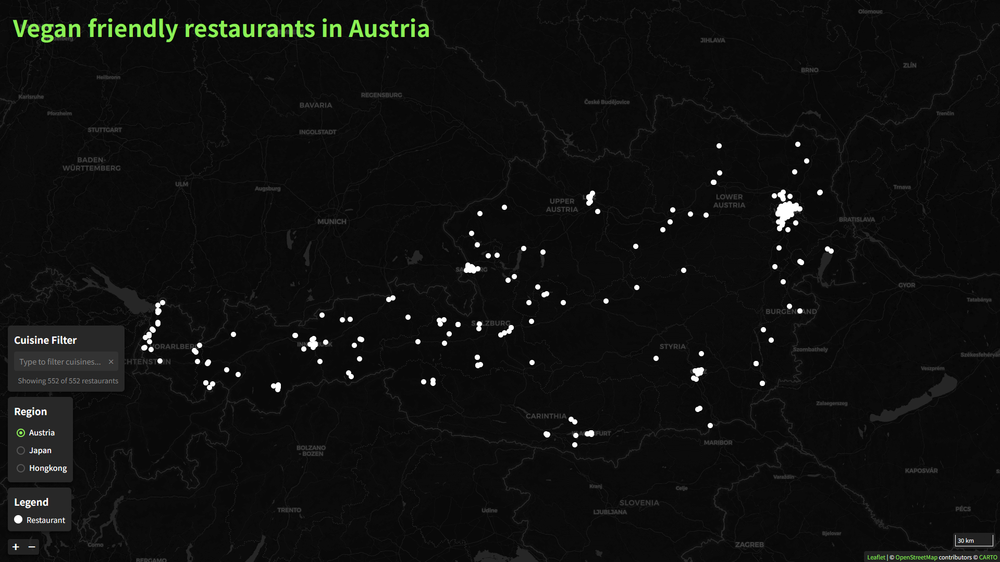

# Vegan friendly restaurants – Interactive Web Map with Leaflet

[Demo](https://lschweiger-mmt.github.io/info-vis_web_mapping_assignment/)


## Introduction

This project is about creating an interactive web map using the Leaflet.js library. The goal was to display restaurants with vegan options in Salzburg and other areas I'm planning to visit during my vacation – specifically Austria, Japan, and Hong Kong. The map includes useful interactive features like popups and hover effects, and also allows filtering based on cuisine types.

## Target Users

The map is designed for:
- Vegans looking for suitable restaurants while traveling
- Tourists planning a trip to Austria, Japan, or Hong Kong
- People who want a quick overview of where vegan-friendly restaurants are located

## Data Sources

I used [Overpass Turbo](https://overpass-turbo.eu/) to query OpenStreetMap (OSM) data. The query filters for:

```
amenity=restaurant
diet:vegan=yes
```

I exported the results as GeoJSON files, one for each region:
- `austria.geojson`
- `japan.geojson`
- `hongkong.geojson`

These files are then loaded into the Leaflet map.

## Methodology & Tools

- **Map Library**: Leaflet.js
- **Base Map**: OpenStreetMap tiles
- **Data Format**: GeoJSON
- **Filtering**: Custom JavaScript for cuisine filtering with an autocomplete input
- **Interactivity**: Hover tooltips and detailed popups
- **Animation**: Basic fade-in/fade-out effect when popups appear

## Features

### 1. Layer Selection
Users can switch between Austria, Japan, and Hong Kong using a dropdown menu. Each selection loads the corresponding GeoJSON file and adjusts the map view.

### 2. Hover Effect
When hovering over a restaurant marker, a tooltip shows the restaurant’s name.

### 3. Popups
Clicking a marker shows a popup with detailed information (if available):
- Name
- Opening hours
- Cuisine
- Phone number
- Website (clickable)

### 4. Cuisine Filter with Autocomplete
There’s a text input where users can type a cuisine (e.g. "Japanese", "Italian"). Matching options appear in a dropdown. Selecting a cuisine filters the visible markers accordingly.

### 5. Styling
All markers are styled as small white circles. No color differentiation is used, to keep the design minimal and consistent across regions.

### 6. Subtle Animation
When a popup opens, it fades in with a basic animation. This adds a bit of polish and improves user experience.

## Design Decisions

- I kept the markers simple so they don't distract from the map itself.
- I used OpenStreetMap tiles for the base map because they’re open-source and have good international coverage.
- Filtering by cuisine makes the map more useful in cities with many vegan options, like Tokyo or Vienna.

## Limitations and Potential Improvements

- **Clustering**: In dense areas like Tokyo, markers can overlap. Using something like `Leaflet.markercluster` could improve usability.
- **Live Data**: Currently, the data is static. In the future, I could fetch live data from Overpass API instead of exporting GeoJSON manually.
- **More Styling**: I could add custom icons or colors for different cuisines or regions.
- **Mobile Optimization**: The map works on mobile but could be optimized better for small screens.

## Reflection

This project helped me learn a lot about Leaflet and web mapping. One challenge was filtering the markers efficiently without making the map reload. Also, working with real data from OpenStreetMap taught me how detailed and messy real-world geographic data can be.

I also liked the idea of building a map that I can actually use on my trip. It makes the project feel more personal and practical.

## Key Takeaways

- Leaflet is a very beginner-friendly but powerful tool for interactive maps
- OpenStreetMap + Overpass is great for custom map data
- Even small features like tooltips and animations can really improve usability
- Filtering and interactivity matter more than fancy design

## Files

- `index.html` – main HTML file
- `app_basic.js` – JavaScript logic for Leaflet and filtering
- `style.css` – optional custom styling
- `austria.geojson`
- `japan.geojson`
- `hongkong.geojson`
